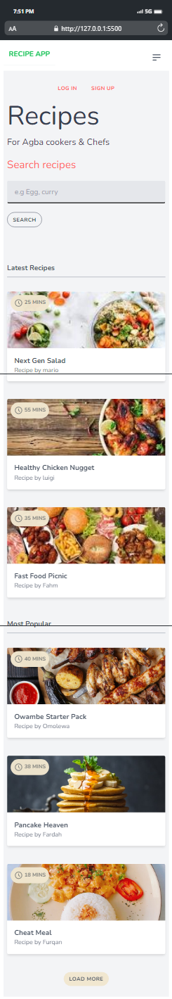
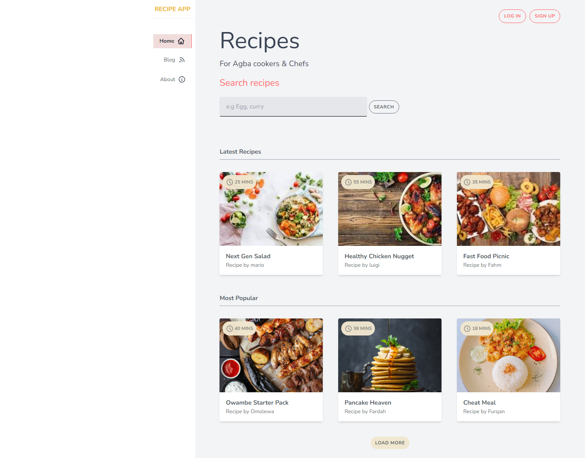

## Food App


#### Link to the live website:
>[Foodapp](https://devrecipeapp.netlify.app/ "foodApp live site")
___

#### Description 
>Recipe App is a web app made with Tailwind CSS, for searching recipes of foodstuffs. It uses the Edamame API to achieve this. It also contains a blog page which is connected to Firebase, and as a form with JS validation to add a new blog post, you can also delete Blogpost from the Firebase DB.
____

#### Tech Used:
 >Html, CSS, JavaScript, TailWindCSS, Firebase, git, github, Netlify.
___

> #### Things i have learnt : how to use TailWind CSS, Firebase
```CSS
@import url('https://fonts.googleapis.com/css2?family=Nunito:ital,wght@0,300;0,400;0,500;0,600;0,700;0,800;0,900;1,300;1,500;1,600;1,700&display=swap');

@tailwind base;
@tailwind components;
@tailwind utilities;

.card {
    @apply bg-white rounded overflow-hidden shadow-md relative hover:shadow-lg cursor-pointer;
}   

.badge {
    color : #888883;
    @apply bg-secondary-100 text-secondary-200 text-xs uppercase font-bold rounded-full p-2 absolute top-0 ml-2 mt-2;
}

.btn {
    @apply rounded-full py-2 px-3 uppercase text-xs font-bold cursor-pointer tracking-wider hover:bg-primary hover:text-white transition ease-out duration-500;
}

.login-wrapper, .login {
    height: 70vh;
}

.login-wrapper .img {
    height: 100vh;
}

.container {
    @apply w-full mr-auto ml-auto;
}

module.exports = {
  content: ["./src/*.{html, js}", "./index.html"],
  theme: {
    extend: {
      colors: {
        primary: '#FF6363',
        secondary: {
          100: '#f1e7cff8',
          200: '#888883',
          300: '#f1dcdc',
        }
      },
      fontSize: {
        fahm: '12rem',
      },
      fontFamily: {
        body: ['Nunito']
      }
    },
  },
  plugins: [],
}


```

```JavaScript
    db.collection("recipes").get().then((querySnapshot) => {
        querySnapshot.forEach((doc) => {
            const recipes = doc;
            addBlog(recipes);
        });
    });
```
---




> #### Desktop View



> #### Credits: 
Scythe

NetNinja